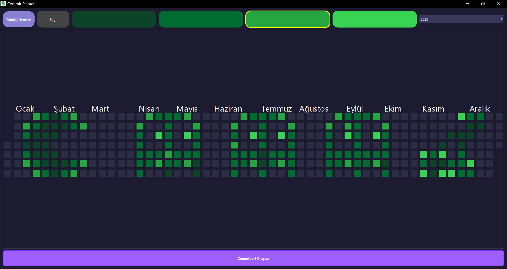
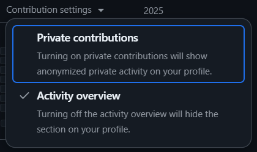

# 🎨 Fake Commit Design

---



> **Hayal gücünüzü GitHub katkı grafiğinize yansıtın!**  
> Bu araç sayesinde GitHub profilinizin katkı grafiğini dilediğiniz şekil ve resimlerle süsleyebilirsiniz. Sınır sadece hayal gücünüz!

---

## 🚀 Özellikler

- 🖌️ **Özgür Tasarım:** Boş bir GitHub deposunda istediğiniz şekli veya resmi oluşturabilirsiniz.
- 🧠 **Sınırsız Tasarım:
  ** Sadece hayal gücünüzle sınırlısınız; herhangi bir resmi veya deseni katkı grafiğinize yansıtabilirsiniz.
- 🛠️ **Kolay Kullanım:** Basit adımlarla istediğiniz tasarımı oluşturabilirsiniz.

---

## 🛠️ Kurulum ve Kullanım

1. **Depoyu Klonlayın:**

   ```bash
   git clone https://github.com/k0laa/Fake_Commit_Design.git
   cd Fake_Commit_Design
   ```
2. **Gereksinimleri Yükleyin:**
   ```bash
   pip install -r requirements.txt
   ```

3. **Uygulamayı Başlatın:**
   ```bash
   python main.py
   ```

4. **Tasarımınızı Oluşturun:**
    - Uygulama arayüzü üzerinden istediğiniz şekli çizin.


5. **GitHub'a Yükleyin:**
    - Oluşturulan commit'leri GitHub deposuna gönderin.
    - Katkı grafiğinizde tasarımınızın yansımasını görün.

---

## 🐞 Sorun Giderme

1. **Eğer katkılarınız GÖzükmüyorsa:**
    - GitHub ayarlarından "Contributions" kısmını kontrol edin.
    - "Include private contributions on my profile" seçeneğini aktif edin.
    - 


2. **Commitleri Silmek İstiyorsanız:**
   - basit yoldan github deponuzu silebilirsiniz.
   
   _veya:_

   - [StackOverflow](https://stackoverflow.com/questions/12345678/how-to-delete-a-commit-in-git) üzerinden detaylı bilgi alabilirsiniz.

---

## 💡 Tavsiyeler ve İpuçları

- **Depo Erişilebilirliği:** Tasarımınızı oluşturduğunuz deponun gizli olması önerilir.

- **Tasarım Planlama:** İnternet üzerinden pixelart tasarımlarından ilham alabilirsiniz.  
  Tasarım için: [Pixelart](https://www.pixelartmaker.com/)

- **Renk Yoğunluğu:** Derinlik ve kontrast için farklı renk tonları kullanın.

- **Canlı Görüntü**: Github profilimde 2022 senesi >>> [k0laa](https://github.com/k0laa?tab=overview&from=2022-12-01&to=2022-12-31)

---

## 🛠️ Geliştirici Notları

**_eklenmesi planlanan özellikler:_**

- **Hazır Şablonlar:** Kullanıcıların hızlıca başlayabilmesi için hazır şablonlar eklenmesi.
- **Yazılar ve Fontlar:** Kullanıcıların yazı tasarımı yapabilmesi için font ve seçenekleri eklenmesi.
- **Özelleştirilebilir Şekiller:** Kullanıcıların kendi şekillerini oluşturabilmesi.
- **Daha Fazla Tasarım Aracı:** Kullanıcıların tasarımlarını daha da geliştirebileceği araçlar eklenmesi.
- **Kullanıcı Arayüzü İyileştirmeleri:** Kullanıcı deneyimini artırmak için arayüzde iyileştirmeler yapılması.

----

## 📜 Lisans

Bu proje [MIT Lisansı](LICENSE) altında lisanslanmıştır. Proje, açık kaynaklı bir yazılım olarak geliştirilmiştir ve herkes tarafından kullanılabilir. Ancak, proje ile ilgili herhangi bir sorumluluk kabul edilmez.

